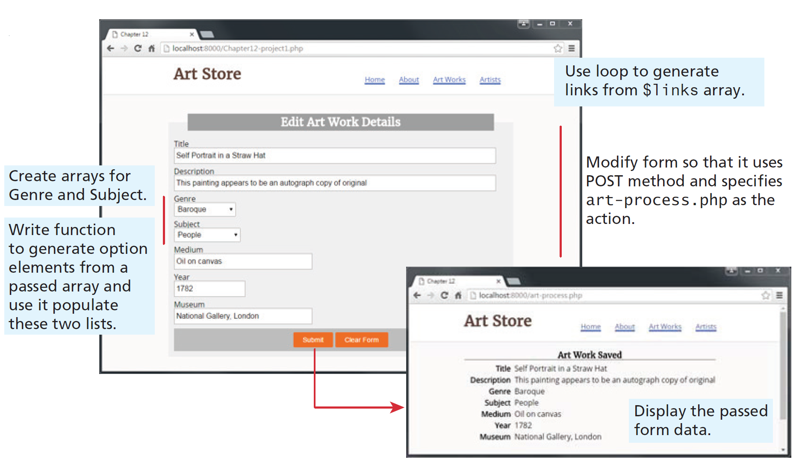

# In-class PHP activity 005-2
## Github Classrooms
1. From now on, we will be using Github classroom to do in-class activities.
   The notes about commits are still relevant here:
   You can make as many commits and as many pushes as needed to that branch that was newly created.
   To be consistent, use the same styling for commit messages that was given in the Project I:
- [Prefix] – [Short description of the change].

The following are the only possible options for
- FEAT - For new features or major additions to the project.

    - Example: FEAT - Added contact form to the Contact page
- FIX - For bug fixes, corrections, or revisions to the code.

    - Example: FIX - Corrected navigation bar alignment on mobile devices
- STYLE - For stylistic changes such as formatting, CSS modifications, or minor visual updates.

    - Example: STYLE - Updated color scheme for better contrast

- DOCS - For changes or additions to the documentation, including README files and comments in the code.

    - Example: DOCS - Added project description and setup instructions to README

- SECURITY - For changes related to improving the security of the website.

    - Example: SECURITY - Implemented input validation for contact form

- REFACTOR - For code refactoring that doesn’t change functionality but improves code quality or organization.

    - Example: REFACTOR - Organized CSS files and cleaned up redundant styles

- TEST - For adding tests or making changes to the testing suite.
    - Example: TEST - Added validation tests for contact form input
2. Submitting your work
   Once, you are sure that all the work is completed, go through the following steps for submission.

Go to your repository copy on GitHub.
Click on the “Pull requests” tab and then the “New pull request” button.
Select the branch you pushed your changes to.
Click “Create pull request” and provide a title and description for your changes.
Submit the pull request.
If you have made a pull request on error or have made further changes to the branch, you can always close the pull request that was made and make a new pull request.
The closest pull request to the due date will be reviewed.
### 5. Submitting your work
Once, you are sure that all the work is completed, go through the following steps for submission.
- Go to your forked repository on GitHub.
- Two ways to submit - 
  - Make a PR to merge to main
  - Or, simply have all your code pushed into the main branch.
  - Your final answer to the project must be present on the main branch.
- The closest pull request to the due date will be reviewed.

### 6. Grading and Feedback
- After the submission deadline, your pull request will be reviewed.
- Feedback and grades will be provided based on the changes made and the quality of the work.

Not sure, how to create a pull request, check this [link](https://docs.github.com/en/pull-requests/collaborating-with-pull-requests/proposing-changes-to-your-work-with-pull-requests/creating-a-pull-request-from-a-fork).

# Project description
Demonstrate your ability to create a data-driven PHP page and to use superglobal
arrays.

Ask ChatGPT on how to install PHP on your machine - windows/mac.

Once installed navigate to this cloned repo on the terminal and type in the following commands to check the successful installation and start the PHP server:

* `php -v`
* `php -S localhost:8000`

Open a browser and access the http://localhost:8000/proj2.php webpage, after starting the PHP server in the home folder location.

1. You have been provided with two files: the data entry form (`proj2.php`)
   and the page that will process the form data (`art-process.php`). Examine both
   in the browser.
2. Modify `proj2.php` so that it uses the POST method and specify `artprocess.php` as the form action.
3. Write a loop that uses the `$links` array in the `data.inc.php` to generate the
   hyperlinks in the header.
4. Define two string arrays, one containing the genres Abstract, Baroque, Gothic,
   and Renaissance, and the other containing the subjects Animals, Landscape,
   and People.
5. Write a function that is passed a string array and which returns a string
   containing each array element within an `<option>` element. Use this function
   to output the Genre and Subject `<select>` lists.
6. Modify `art-process.php` so that it displays the all the values that were entered
   into the form, as shown in the below figure. This will require using the appropriate
   superglobal array.
7. Test the page. Be sure to verify appropriate error messages are displayed when
   art-process.php is requested without POST data.

## Tips and Suggestions
* Start small: Break this problem down into smaller steps. First verify the globals are being read properly in the PHP file.
* You may decide to move your code into classes within your module after you
  finished your code, or you may decide to work with classes and modules right
  from the start.
* **DON’T USE ABSOLUTE PATHS**. Use only relative paths in your project files. This practice is particularly important when multiple people are working on the same project, as it ensures that links and references work correctly across different environments and systems.
* Iterate and Test: Continuously test your website after making necessary changes.
* Issues: Use the GitHub to create Issues and track the status of the issues using Milestones.
* Focus on Details: Pay attention to small details like spacing, hover effects, to create a polished final product.

